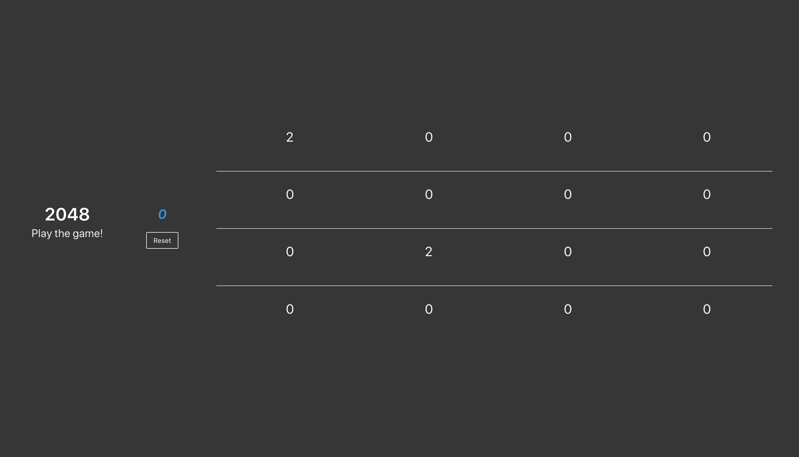
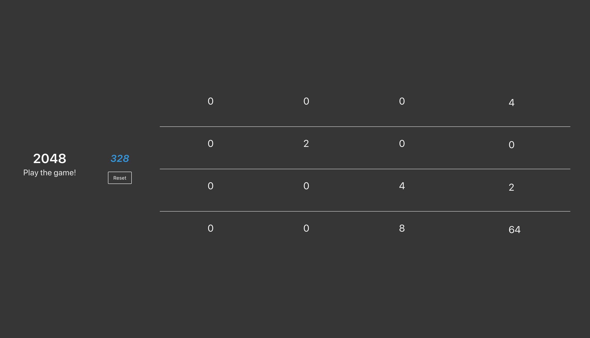

# 2048Game
A 2048 Game clone made for a class assignment with the Bulma CSS framework and jQuery library. The clone is able to play a full operational game of 2048 and keeps the score accordingly.

## Screenshots
### Landing Page

### Game In Progress

## Requirements
1. When the page first loads, the game must be initialized to a random starting state.
2. The player must be able to input moves by pressing the arrow keys on the keyboard.
3. The game board must be displayed on the page and updated as moves are made.
4. The score must be displayed on the page and updated as moves are made.
5. A button must be included in the user interface that allows the player to reset the game to an initial starting position.
6. When the game is over, the user interface must visually display that the game is over.
7. If the player wins the game, the user interface must visually display that the game is won.

## Rubric
- The Game class works (autograded portion)
- The user interface responds to arrow key presses and moves the game correctly
- The user interface displays the game board and updates it correctly
- The user interface displays the game score and updates it correctly
- The user interface includes a working "reset" button which resets the state of the game when pressed
- The user interface includes a brief set of instructions for newbies (this can be as easy as a single sentence, like in the reference game)
- The user interface indicates when the game is over or won
- The production-ready final product doesn't have any leftover debugging alert() or console.log() code

## GameState Object
| Field | Type | Value |
--------|------|-------|
| board | number[] | A one-dimensional array of (size squared) numbers that represents the value of each tile on the board. Represented as a flat array in row major order. 0 should be used where no tile is present. |
| score | number | The score of the game at the current instant in time. Initially, the score should be set to zero. Every time the player makes a move that combines two tiles, the combined value should be added to the score (e.g. if two 128 tiles are merged to make a 256 tile, then you add 256 to the score). |
| won | boolean | True if a user has combined two 1024 tiles to make a 2048 tile |
| over | boolean | True if the board is in a state such that no more moves can be made |